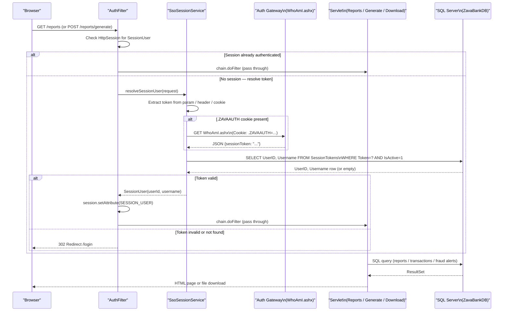

# API & Service Communication Contracts

ZavaComplianceReporter exposes 6 synchronous HTTP endpoints served by Java Servlets; all inter-system communication is synchronous (direct JDBC to SQL Server, outbound HTTP to the ZavaBank Auth Gateway).

## Service Catalog

| Service | Port | Category | Purpose |
|---------|------|----------|---------|
| ZavaComplianceReporter (WAR) | 8080 (Tomcat default) | Business | Serves login, compliance-report listing, CTR/SAR generation, and report download for bank compliance officers |
| ZavaBank Auth Gateway (external) | 8080 (configured via `auth.gateway.whoami.url`) | Infrastructure | .NET service that resolves a `.ZAVAAUTH` FormsAuthentication cookie to a Java-readable session token via `WhoAmI.ashx` |

## API Endpoints Inventory

| Service | Method | Path | Request Type | Response Type |
|---------|--------|------|--------------|---------------|
| HealthServlet | GET | `/health` | None | `200 OK` plain text `"OK"` |
| LoginServlet | GET | `/login` | None | HTML (login.jsp) — redirects to `/reports` if already authenticated |
| LoginServlet | POST | `/login` | Form params: `sessionToken` (text) | Redirect `302 /reports` on success; re-renders login.jsp with error on failure |
| ReportsServlet | GET | `/reports` | HTTP session (authenticated) | HTML (reports.jsp with report list) — requires authenticated session |
| GenerateReportServlet | POST | `/reports/generate` | Form params: `reportType` (CTR\|SAR), `thresholdAmount` (decimal, CTR only) | Redirect `302 /reports` — requires authenticated session |
| DownloadReportServlet | GET | `/reports/download` | Query param: `reportId` (integer) | `200 OK` `text/plain` file attachment; redirects to `/reports` if not found — requires authenticated session |

> **Note:** `index.jsp` (mapped to `/`) immediately redirects to `/reports` via a JSP scriptlet redirect — it is not a controller endpoint.

## Management & Observability Endpoints

| Service | Endpoint | Notes |
|---------|----------|-------|
| HealthServlet | `GET /health` | Returns plain-text `"OK"` with HTTP 200; suitable for basic container liveness probes. No dependency checks (database, auth gateway) are performed. |

No Spring Boot Actuator, Micrometer metrics, Prometheus endpoint, or distributed tracing is configured. Custom metric registration is absent.

## DTOs & Contracts

| Class | Layer | Role | Mutability |
|-------|-------|------|-----------|
| `SessionUser` | Domain Model | Represents the authenticated user once SSO resolution succeeds; stored in `HttpSession`; used as an implicit request identity by all protected servlets | Immutable (final fields, constructor-only assignment) |
| `ReportRecord` | Domain Model | Response model for one row in the compliance-reports list rendered by `reports.jsp`; populated by `ReportsServlet` and passed as a request attribute | Mutable (JavaBean-style getters/setters) |

There are no request body DTOs — all input arrives via HTML form parameters or URL query parameters. There are no OpenAPI/Swagger specifications, protobuf schemas, or GraphQL schemas. No Jackson or other serialization framework is in use (all output is JSP-rendered HTML or plain text).

## Communication Patterns

**Synchronous only.** The application has no message queues, event-driven patterns, or asynchronous processing.

**Inbound**: Browser → Tomcat HTTP (port 8080). No HTTPS/TLS termination is configured at the application level; TLS would need to be handled by a reverse proxy or load balancer in front of Tomcat.

**Outbound to SQL Server**: Direct JDBC using `DriverManager.getConnection()` called per-request with no connection pool. Timeout is governed by the MSSQL JDBC driver defaults; no explicit timeout, retry, or circuit-breaker policy is configured.

**Outbound to Auth Gateway**: `SsoSessionService.resolveTokenFromAuthGateway()` uses `java.net.HttpURLConnection` with a 3-second connect timeout and 3-second read timeout (`setConnectTimeout(3000)`, `setReadTimeout(3000)`). There is no retry logic, circuit breaker, or fallback — if the gateway is unreachable the method returns an empty string and authentication falls through to a database token lookup. Service discovery is absent; the gateway URL is hardcoded in `auth.gateway.whoami.url` configuration.

**Security posture**: The `/reports`, `/reports/generate`, and `/reports/download` paths are protected by `AuthFilter`, which validates the HTTP session and redirects unauthenticated requests to `/login`. The `/health` and `/login` endpoints are publicly accessible with no authentication. No TLS is configured at the application layer. Authorization is coarse-grained (presence of a valid `SessionUser` in the session) with no role-based access control (RBAC) or `@PreAuthorize`-style permission checks.

**Service discovery**: None. Both the SQL Server host and the auth-gateway URL are resolved from static configuration (`compliance.properties` or environment variables).

**Startup dependencies**: The application depends on SQL Server and the auth gateway being reachable at start-up (connection opened on first request). There is no startup health-check mechanism beyond the `/health` endpoint, which does not verify downstream dependencies.

## Service Technology Matrix

| Service | Web Framework | Data Access | Discovery | Gateway | Health Check | Cache | Metrics |
|---------|--------------|-------------|-----------|---------|-------------|-------|---------|
| ZavaComplianceReporter | Servlet 3.1 / JSP | Raw JDBC (DriverManager) | None | None | Custom `/health` | None | None |
| ZavaBank Auth Gateway | .NET (external) | N/A | N/A | N/A | N/A | N/A | N/A |

## Service Communication Sequence

