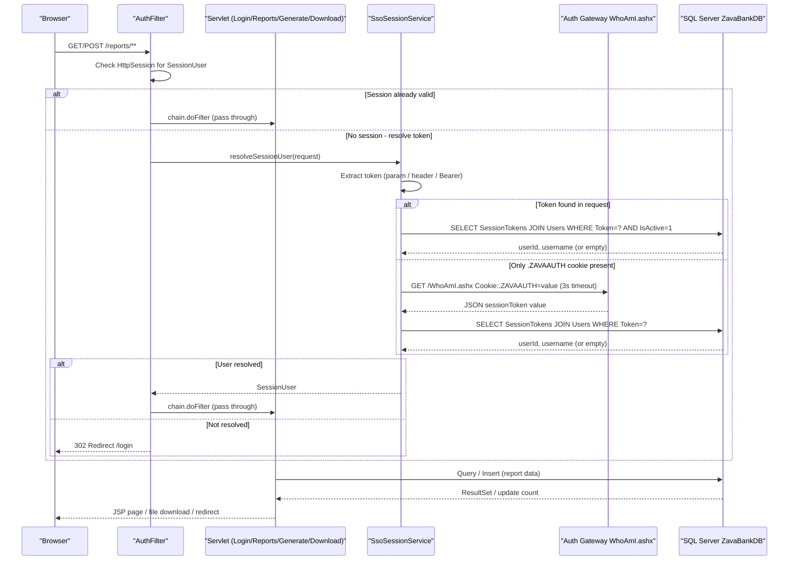

# API & Service Communication Contracts

ZavaComplianceReporter exposes six HTTP endpoints served by plain Java Servlets (no REST framework); all communication is synchronous — inbound HTTP from browsers and one outbound HTTP call to an external SSO auth gateway.

## Service Catalog

| Service | Port | Category | Purpose |
|---|---|---|---|
| ZavaComplianceReporter | 8080 (Tomcat default) | Business | Core compliance reporting web application — generates and serves CTR/SAR regulatory reports |
| Auth Gateway (external) | 8080 | Infrastructure | External .NET SSO gateway; exposes `WhoAmI.ashx` to translate `.ZAVAAUTH` Forms-Auth cookies into session tokens |
| SQL Server (external) | 1433 | Infrastructure | Relational store for user/session data, transaction data, fraud alerts, and compliance reports |

## API Endpoints Inventory

| Service | Method | Path | Request Type | Response Type / Notes |
|---|---|---|---|---|
| HealthServlet | GET | `/health` | — | `text/html` — inline HTML "Online" page; no auth required |
| LoginServlet | GET | `/login` | — | Forwards to `login.jsp`; redirects to `/reports` if already authenticated |
| LoginServlet | POST | `/login` | Form: `sessionToken` (string) | Redirect to `/reports` on success; re-renders `login.jsp` with error on failure |
| ReportsServlet | GET | `/reports` | — | Forwards to `reports.jsp` with list of `ReportRecord` objects; requires authentication |
| GenerateReportServlet | POST | `/reports/generate` | Form: `reportType` (CTR/SAR), `thresholdAmount` (decimal, CTR only) | Redirect to `/reports`; requires authentication |
| DownloadReportServlet | GET | `/reports/download` | Query param: `reportId` (integer) | `text/plain` attachment download (`Content-Disposition: attachment`); requires authentication |

## Management & Observability Endpoints

| Service | Endpoint | Notes |
|---|---|---|
| ZavaComplianceReporter | `GET /health` | Custom liveness endpoint returning an HTML page; no structured health-check format (no JSON, no status codes beyond HTTP 200) |

No Spring Boot Actuator, Micrometer metrics, or Prometheus export endpoints are present. No custom metric annotations or telemetry instrumentation are configured.

## DTOs & Contracts

**Service-level model classes** (not exposed as API contracts directly):

| Class | API Role | Mutability | Notes |
|---|---|---|---|
| `SessionUser` | Internal session object; stored in `HttpSession` | Immutable (final fields, no setters) | Not serialized to JSON; passed internally only |
| `ReportRecord` | Response model bound to `reports.jsp` as a request attribute | Mutable (traditional JavaBean with setters) | Used only for server-side JSP rendering; never serialized to JSON |

**No OpenAPI / Swagger specification** is present. No `.proto` files or GraphQL schemas. No Jackson or other JSON library is used — all data exchange is via HTML forms (`application/x-www-form-urlencoded`) for requests and JSP-rendered HTML or `text/plain` for responses. The one external HTTP call (`WhoAmI.ashx`) returns a simple JSON object `{"sessionToken":"<value>"}` which is parsed with a hand-written string search (no JSON library). See `data-architecture.md` for full field details.

## Communication Patterns

**Synchronous (inbound):** All client interactions are synchronous HTTP request/response over the Servlet API. No reactive, streaming, or WebSocket patterns are used.

**Synchronous (outbound):** `SsoSessionService` makes a single synchronous HTTP GET call to the Auth Gateway (`WhoAmI.ashx`) when a `.ZAVAAUTH` cookie is present but no explicit session token is found. The call uses `java.net.HttpURLConnection` with a 3-second connect timeout and 3-second read timeout. There is **no retry policy, circuit breaker, or fallback** — a timeout or non-200 response causes silent authentication failure (returns empty token, user is redirected to login).

**Data access:** Direct JDBC calls to SQL Server via `DriverManager.getConnection()` (no connection pool). Each Servlet method that requires DB access opens a new connection inside a try-with-resources block.

**Service discovery:** The Auth Gateway URL is hardcoded via the `AUTH_GATEWAY_WHOAMI_URL` environment variable / `compliance.properties` property. No dynamic service discovery (Eureka, Consul, Kubernetes DNS) is used.

**API gateway:** No API gateway layer. Tomcat serves requests directly; `AuthFilter` acts as a simple servlet filter, not a gateway.

**Security posture:** Session-based authentication is enforced for `/reports/**` via `AuthFilter`. Session tokens are validated against the SQL Server `SessionTokens` table (active, non-expired, active user check). Token sources (in priority order): form parameter `sessionToken` → `X-Session-Token` header → `Authorization: Bearer` header → `.ZAVAAUTH` cookie resolved through the Auth Gateway. **No HTTPS/TLS is configured at the application level** — transport security must be provided by the surrounding infrastructure (load balancer/reverse proxy). **No CSRF protection** is present on the POST endpoints. **No role-based authorization** is implemented — any authenticated session has full access to all report operations. The `GET /health` endpoint has no authentication check and is publicly accessible.

## Service Technology Matrix

| Service | Web | Data Access | Discovery | Gateway | Health Check | Cache | Metrics |
|---|---|---|---|---|---|---|---|
| ZavaComplianceReporter | Java Servlet 3.1 + JSP/JSTL | Raw JDBC (no ORM) | None (hardcoded URLs) | None | Custom `/health` HTML | None | None |

## Service Communication Sequence

