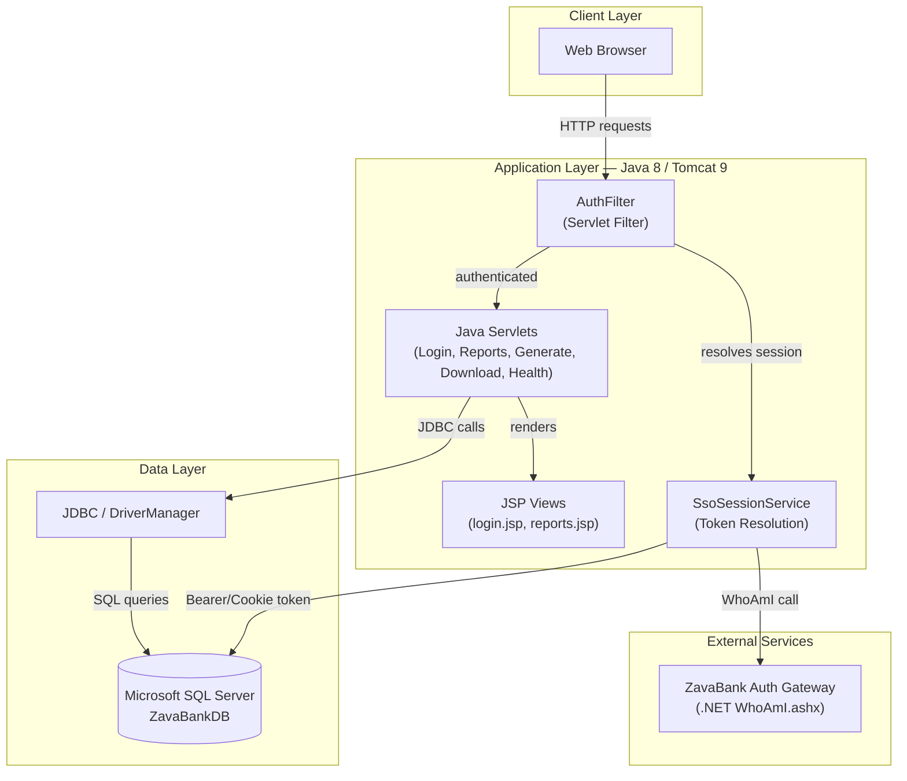
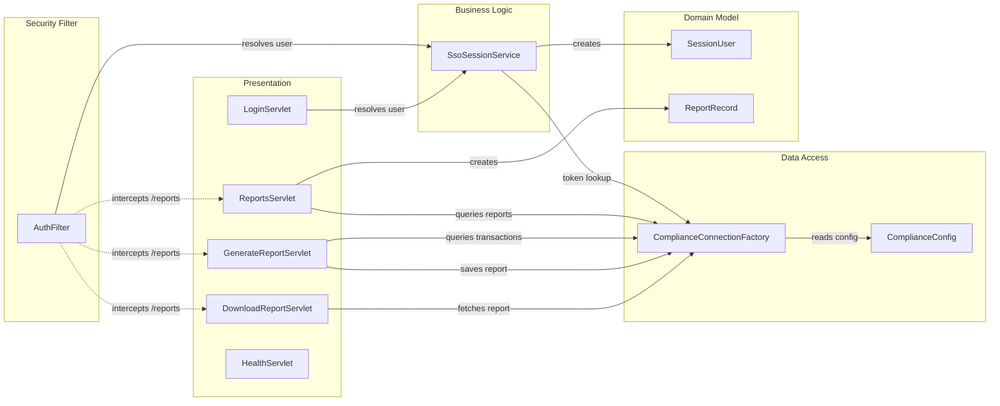

# Architecture Diagram

ZavaComplianceReporter is a Java 8 Servlet/JSP web application deployed on Apache Tomcat 9 that enables bank compliance officers to generate and download CTR (Currency Transaction Reports) and SAR (Suspicious Activity Reports) backed by a Microsoft SQL Server database.

## Application Architecture

### Technology Stack Summary

| Layer | Technology | Version | Purpose |
|-------|-----------|---------|---------|
| Presentation | Java Server Pages (JSP) | 3.1 (javax) | Server-side HTML rendering for login and reports views |
| Presentation | JSTL | 1.2 (javax) | Tag library used in reports.jsp for iteration and expression language |
| Web Framework | Java Servlet API | 3.1 (javax) | HTTP request handling via HttpServlet subclasses |
| Security | Servlet Filter | 3.1 | AuthFilter intercepts protected routes and enforces SSO token validation |
| Business Logic | Plain Java | 8 | Report generation logic (CTR/SAR), SSO resolution, JDBC data access |
| Build & Package | Gradle | 7.6 | WAR packaging and dependency management |
| Runtime Container | Apache Tomcat | 9 (JDK 8) | WAR deployment host |
| Data Access | JDBC / DriverManager | N/A | Direct SQL Server connections via DriverManager.getConnection |
| Database | Microsoft SQL Server | N/A | Stores compliance reports, transactions, accounts, fraud alerts, session tokens, and users |

### Data Storage & External Services

The sole data store is a **Microsoft SQL Server** instance (`ZavaBankDB`) accessed via plain JDBC with `DriverManager.getConnection`. The schema includes `ComplianceReports`, `Transactions`, `Accounts`, `FraudAlerts`, `SessionTokens`, and `Users` tables. There is no connection pool or ORM layer.

The only external service is the **ZavaBank Auth Gateway** (a .NET ASP.NET application), which exposes a `WhoAmI.ashx` endpoint. `SsoSessionService` calls this endpoint over HTTP to exchange the `.ZAVAAUTH` FormsAuthentication cookie for a Java-readable session token when the cookie-based SSO path is used.

### Key Architectural Decisions

- **Servlet-centric MVC without a framework**: The application uses raw `HttpServlet` subclasses and JSP templates instead of a modern web framework (Spring MVC, JAX-RS). Controllers are tightly coupled to the HTTP layer.
- **Session-based authentication via HttpSession**: After token validation, the resolved `SessionUser` is stored in the HTTP session, requiring sticky sessions (session affinity) in any horizontally-scaled cloud deployment.
- **Classpath properties with environment-variable override**: `ComplianceConfig` loads `compliance.properties` from the classpath but checks environment variables first, providing a basic externalisation mechanism.

## Component Relationships

### Component Inventory

| Component | Layer | Type | Responsibility |
|-----------|-------|------|----------------|
| AuthFilter | Security Filter | Servlet Filter | Intercepts `/reports/**` routes; validates session or redirects to login |
| LoginServlet | Presentation | HttpServlet | Renders login form (GET) and processes token-based sign-in (POST) |
| ReportsServlet | Presentation | HttpServlet | Lists compliance reports from the database; forwards to `reports.jsp` |
| GenerateReportServlet | Presentation | HttpServlet | Generates CTR/SAR report content from SQL queries and inserts into `ComplianceReports` |
| DownloadReportServlet | Presentation | HttpServlet | Streams a specific compliance report as a plain-text file attachment |
| HealthServlet | Presentation | HttpServlet | Returns `200 OK` for container health probes |
| SsoSessionService | Business Logic | Plain Java class | Resolves a `SessionUser` from a session token via DB lookup or auth-gateway WhoAmI call |
| ComplianceConnectionFactory | Data Access | Plain Java class | Opens raw JDBC connections to SQL Server using `DriverManager` |
| ComplianceConfig | Data Access / Config | Plain Java class | Reads DB and SSO configuration from environment variables or classpath properties file |
| SessionUser | Domain Model | Plain Java class | Immutable value object holding authenticated user ID and username |
| ReportRecord | Domain Model | Plain Java class | Mutable DTO representing a row from the `ComplianceReports` table |
