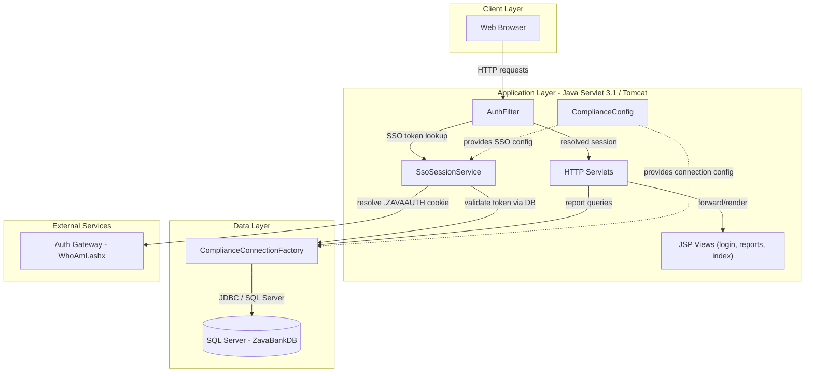
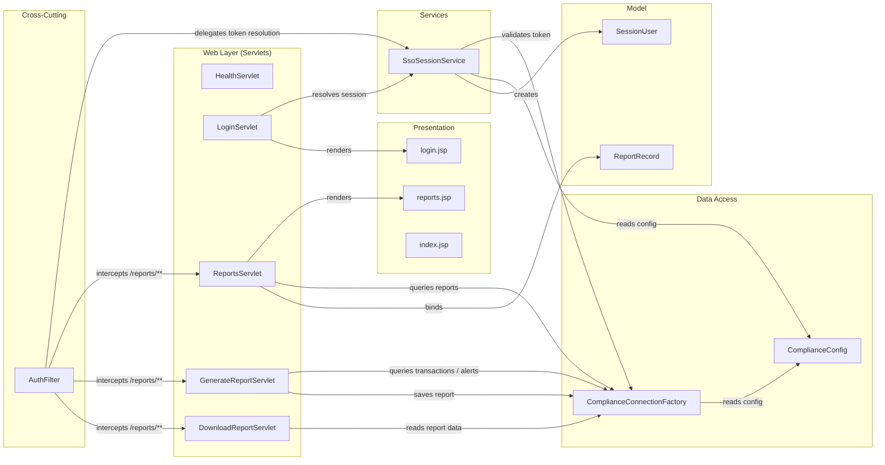

# Architecture Diagram

ZavaComplianceReporter is a Java Servlet/JSP web application deployed on Apache Tomcat that enables compliance officers to generate and download regulatory reports (CTR and SAR) backed by a SQL Server database and a shared SSO auth gateway.

## Application Architecture

### Technology Stack Summary

| Layer | Technology | Version | Purpose |
|---|---|---|---|
| Build | Gradle | 7+ | Build and WAR packaging |
| Presentation | JSP + JSTL | Servlet 3.1 / JSTL 1.2 | Server-side HTML rendering |
| Web Framework | Java Servlet API | 3.1.0 | HTTP request handling |
| Runtime | Apache Tomcat | 9+ | Servlet container |
| Data Access | JDBC (raw) | — | Direct SQL Server connectivity |
| Database Driver | Microsoft JDBC Driver for SQL Server | 12.8.1 | SQL Server connectivity |
| Language | Java | 1.8 | Application language |

### Data Storage & External Services

The application relies on a single **Microsoft SQL Server** database (`ZavaBankDB`) for all persistence: user accounts and session tokens (`Users`, `SessionTokens`), financial transaction data (`Transactions`, `Accounts`), fraud alert data (`FraudAlerts`), and compliance report storage (`ComplianceReports`). Connection parameters are supplied via environment variables (`DB_HOST`, `DB_PORT`, `DB_NAME`, `DB_USER`, `DB_PASSWORD`) with fall-back to `compliance.properties`. An external **Auth Gateway** service (`zava-auth-gateway:8080/WhoAmI.ashx`) is called over HTTP when a `.ZAVAAUTH` forms-authentication cookie is present; it translates the .NET FormsAuth cookie into a plain session token that this Java application can validate against the database.

### Key Architectural Decisions

- **Raw JDBC with manual connection management**: the application uses `DriverManager.getConnection` directly (no connection pool, no ORM), opening a new connection per request in try-with-resources blocks.
- **Filter-based authentication**: `AuthFilter` gates all `/reports` URL patterns, delegating session resolution to `SsoSessionService` which supports three token sources (query parameter, `X-Session-Token` header, ****** plus the auth-gateway SSO cookie fallback.
- **Configuration via environment variables with properties file fallback**: `ComplianceConfig` reads from environment first, falling back to the bundled `compliance.properties`, making the app deployable in containers without rebuilding.

## Component Relationships

### Component Inventory

| Component | Layer | Type | Responsibility |
|---|---|---|---|
| AuthFilter | Cross-Cutting | Servlet Filter | Intercepts `/reports/**` requests; validates session or redirects to login |
| LoginServlet | Web Layer | HttpServlet | GET shows login form; POST resolves session token and creates session |
| ReportsServlet | Web Layer | HttpServlet | Lists saved compliance reports from DB and forwards to reports.jsp |
| GenerateReportServlet | Web Layer | HttpServlet | Generates CTR or SAR report from DB data and persists it |
| DownloadReportServlet | Web Layer | HttpServlet | Streams stored report data as a plain-text file download |
| HealthServlet | Web Layer | HttpServlet | Exposes `/health` liveness endpoint |
| SsoSessionService | Services | POJO Service | Resolves a session token from request (param/header/cookie/auth-gateway) and looks it up in DB |
| ComplianceConnectionFactory | Data Access | JDBC Factory | Opens raw JDBC connections to SQL Server using config from ComplianceConfig |
| ComplianceConfig | Data Access | Configuration | Reads DB and SSO config from environment variables with properties-file fallback |
| SessionUser | Model | POJO | Holds authenticated user id and username for the HTTP session |
| ReportRecord | Model | POJO | Transfer object for a compliance report row returned by ReportsServlet |
| login.jsp | Presentation | JSP View | Login form page |
| reports.jsp | Presentation | JSP View | Report listing and generation form page |
| index.jsp | Presentation | JSP View | Welcome page that redirects to /reports |
