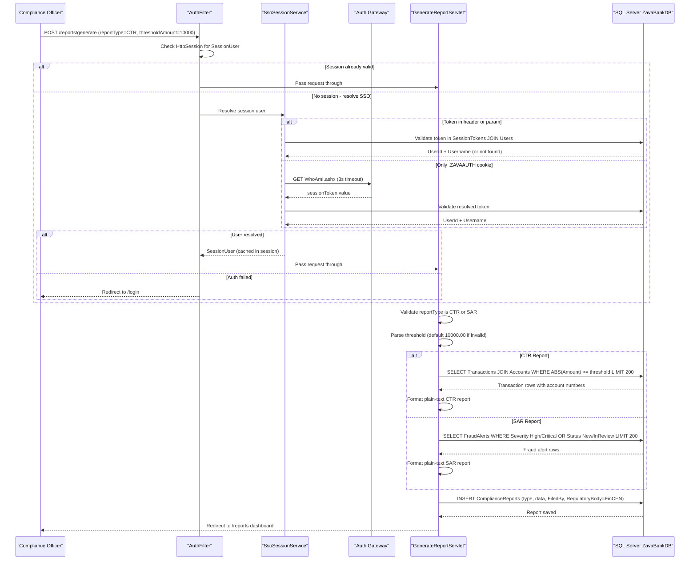

# Core Business Workflows

ZavaComplianceReporter is a regulatory compliance tool for bank staff that automates the generation and filing of mandated financial crime reports — Currency Transaction Reports (CTR) for large-value cash transactions and Suspicious Activity Reports (SAR) for fraud alerts — submitted to FinCEN.

## Domain Entities

| Entity | Service / Bounded Context | Description | Key Relationships |
|---|---|---|---|
| User | Identity & Access | A bank staff member who may log in and file compliance reports | Authenticated via session token; linked to SessionTokens and ComplianceReports |
| SessionToken | Identity & Access | An active, time-bounded authentication credential for a User | Belongs to a User; expires at a set time; must be active and non-expired for access |
| Account | Transaction Monitoring | A bank customer account that holds financial activity | Has many Transactions |
| Transaction | Transaction Monitoring | A financial transaction recorded against an Account | Belongs to an Account; may trigger FraudAlerts; included in CTR if above threshold |
| FraudAlert | Transaction Monitoring | A system-generated alert flagging a Transaction as suspicious | Belongs to a Transaction; has severity (High/Critical) and status (New/InReview/Resolved) |
| ComplianceReport | Regulatory Filing | A generated regulatory report (CTR or SAR) filed by a staff member | Filed by a User; contains report type, filing date, filer identity, and full report text |

## Service-to-Domain Mapping

ZavaComplianceReporter is a monolithic application — all bounded contexts are implemented within a single service and share a single database.

| Service | Domain Context | Owned Entities | External Dependencies |
|---|---|---|---|
| ZavaComplianceReporter | Identity & Access | User, SessionToken | Auth Gateway (WhoAmI.ashx) for `.ZAVAAUTH` cookie resolution |
| ZavaComplianceReporter | Transaction Monitoring | Account, Transaction, FraudAlert | SQL Server (ZavaBankDB) — data written by upstream banking systems |
| ZavaComplianceReporter | Regulatory Filing | ComplianceReport | SQL Server (ZavaBankDB) for report persistence |

The Transaction and FraudAlert data are owned by upstream banking systems; ZavaComplianceReporter reads this data but does not produce it. ComplianceReports are the sole domain output written exclusively by this application.

## Primary Workflows

### Workflow 1: User Authentication via SSO

A staff member accesses the application and is authenticated through the shared bank SSO infrastructure. On any request to `/reports/**`, `AuthFilter` intercepts and attempts to resolve a `SessionUser` from the current HTTP session. If no session exists, it delegates to `SsoSessionService` which probes multiple token sources in priority order: form parameter → `X-Session-Token` header → `Authorization: Bearer` → `.ZAVAAUTH` SSO cookie (resolved via Auth Gateway). A resolved session token is validated against the `SessionTokens` table (active, non-expired, active user). On success the `SessionUser` is stored in the HTTP session for the remainder of the session lifetime, avoiding repeated DB lookups. On failure the user is redirected to the login page.

**Steps:**
1. Browser submits request to `/reports/**`
2. `AuthFilter` checks `HttpSession` for existing `SessionUser`
3. If absent: extract token from request (param / header / ****** cookie)
4. If cookie only: call Auth Gateway (`WhoAmI.ashx`) with a 3-second timeout to resolve token
5. Validate token against `SessionTokens` + `Users` tables
6. On success: cache `SessionUser` in session → pass request through
7. On failure: redirect to `/login`

### Workflow 2: Generate Currency Transaction Report (CTR)

A compliance officer generates a CTR to report cash transactions at or above a configurable threshold (default: $10,000 as required by the Bank Secrecy Act). The officer submits the `/reports/generate` form with `reportType=CTR` and an optional `thresholdAmount`. The system queries all transactions with `ABS(Amount) >= threshold` (most recent 200 rows), formats a plain-text report, and stores it as a new `ComplianceReport` record attributed to the filing officer and destined for FinCEN.

**Steps:**
1. Authenticated officer submits `POST /reports/generate` with `reportType=CTR` and optional `thresholdAmount`
2. Validate report type (must be CTR or SAR); redirect to `/reports` if invalid
3. Parse threshold: use provided value or default to `10000.00` if absent/invalid
4. Query `Transactions JOIN Accounts WHERE ABS(Amount) >= threshold ORDER BY TransactionDate DESC LIMIT 200`
5. Format plain-text CTR report with transaction details
6. Insert new `ComplianceReport` row (`ReportType=CTR`, `Status=Generated`, `RegulatoryBody=FinCEN`, `FiledBy=<username>`)
7. Redirect to `/reports`

### Workflow 3: Generate Suspicious Activity Report (SAR)

A compliance officer generates a SAR to report fraud alerts flagged by the bank's fraud detection system as high-severity or unresolved. The officer submits the `/reports/generate` form with `reportType=SAR`. The system queries `FraudAlerts` where `Severity IN ('High','Critical') OR Status IN ('New','InReview')`, formats a plain-text report, and stores it as a new `ComplianceReport`.

**Steps:**
1. Authenticated officer submits `POST /reports/generate` with `reportType=SAR`
2. Query `FraudAlerts WHERE Severity IN ('High','Critical') OR Status IN ('New','InReview') ORDER BY CreatedDate DESC LIMIT 200`
3. Format plain-text SAR report with alert details
4. Insert new `ComplianceReport` row (`ReportType=SAR`, `Status=Generated`, `RegulatoryBody=FinCEN`, `FiledBy=<username>`)
5. Redirect to `/reports`

### Workflow 4: View and Download Reports

An authenticated officer views the list of previously generated reports and downloads the full report text for submission to FinCEN. `ReportsServlet` loads the 100 most recent `ComplianceReports` and renders them in the reports dashboard. `DownloadReportServlet` streams the full `ReportData` text of a specific report as a plain-text file attachment named `<ReportType>-<ReportID>.txt`.

**Steps:**
1. Authenticated officer navigates to `GET /reports`
2. System queries `ComplianceReports ORDER BY FilingDate DESC LIMIT 100`
3. Dashboard is rendered showing report ID, type, filing date, status, and filer
4. Officer clicks Download link → `GET /reports/download?reportId=N`
5. System queries full `ReportData` for the given report ID
6. Response streams as `text/plain` attachment for offline submission to FinCEN

## Cross-Service Data Flows

ZavaComplianceReporter is a single-service application — there are no upstream microservices for report data. However, it reads from two data domains that it does not own:

- **Transaction + Account data** (populated by the bank's core banking system): read-only queries for CTR generation. The application assumes this data exists and is current — there is no import pipeline or event-driven sync.
- **FraudAlerts data** (populated by the bank's fraud detection system): read-only queries for SAR generation. Same assumption applies.
- **Auth Gateway** (external .NET SSO service): called synchronously during `.ZAVAAUTH` cookie-based login. If unavailable (timeout / non-200), the token resolves to empty and the user is redirected to the login page — there is no retry or cached-session fallback for this path.

No event-driven or asynchronous composition patterns exist. All data flows are synchronous JDBC queries within the same database.

## Business Workflow Sequence

## Business Rules & Decision Logic

### Validation Rules

- **Report type**: Only `CTR` and `SAR` are accepted values for `reportType` (case-insensitive). Any other value causes an immediate redirect to `/reports` with no error message shown to the user.
- **CTR threshold**: The `thresholdAmount` form parameter must parse as a valid `BigDecimal`. If absent, empty, or non-numeric, the system silently defaults to `10000.00` (the BSA regulatory threshold) with no validation error.
- **Report ID**: The `reportId` query parameter on the download endpoint must parse as a valid integer; invalid values redirect silently to `/reports`.
- **Session token**: A token is valid only if it exists in `SessionTokens`, `IsActive = 1`, `ExpiresAt > GETDATE()`, and the linked `User.IsActive = 1`. All conditions must be simultaneously true.

### Decision Logic

- **Auth token source priority**: The system attempts token sources in this order until one yields a non-empty value: (1) `sessionToken` form parameter, (2) `X-Session-Token` header, (3) `Authorization: Bearer` value, (4) `.ZAVAAUTH` cookie resolved via Auth Gateway. The first non-empty value wins.
- **CTR query scope**: The `ABS()` function means both large credits and large debits are included in a CTR, matching the BSA requirement to report both cash-in and cash-out transactions. Results are capped at 200 rows by `TOP 200`.
- **SAR alert scope**: Alerts are included if they meet either a severity condition (`High` or `Critical`) or a status condition (`New` or `InReview`) — these are OR-joined, so a low-severity unresolved alert is included, and a resolved high-severity alert is also included.

### State Transitions

- **SessionToken lifecycle**: Tokens are validated at request time (active + non-expired). Expiry is managed externally (by the auth gateway / upstream system). The application never creates, renews, or invalidates tokens.
- **ComplianceReport lifecycle**: Reports are created with `Status = 'Generated'`. There is no status progression (no `Filed`, `Submitted`, or `Archived` transition) — the status field is set once at creation and never updated.

### Cross-Cutting Concerns

- **Transactions**: No explicit transaction management. Each JDBC operation runs in its own auto-commit connection. There is no rollback behavior — if the `INSERT INTO ComplianceReports` fails, no error is surfaced to the user (exception is silently swallowed).
- **Error handling**: All exceptions are caught and silently discarded (`catch (Exception ignored)`) throughout the data access layer. Business failures (DB unavailable, no matching data) result in empty reports or silent redirects with no user-facing error messages.
- **Audit trail**: The `FiledBy` column records the authenticated username at report generation time. No other audit log (creation/update timestamps beyond `CreatedDate`, IP address, action log) is maintained.
- **Authorization**: There is a single authorization level — any authenticated user can generate any type of report and download any report. There is no role-based access control, no per-user data scoping, and no approval workflow before a report is finalized.
