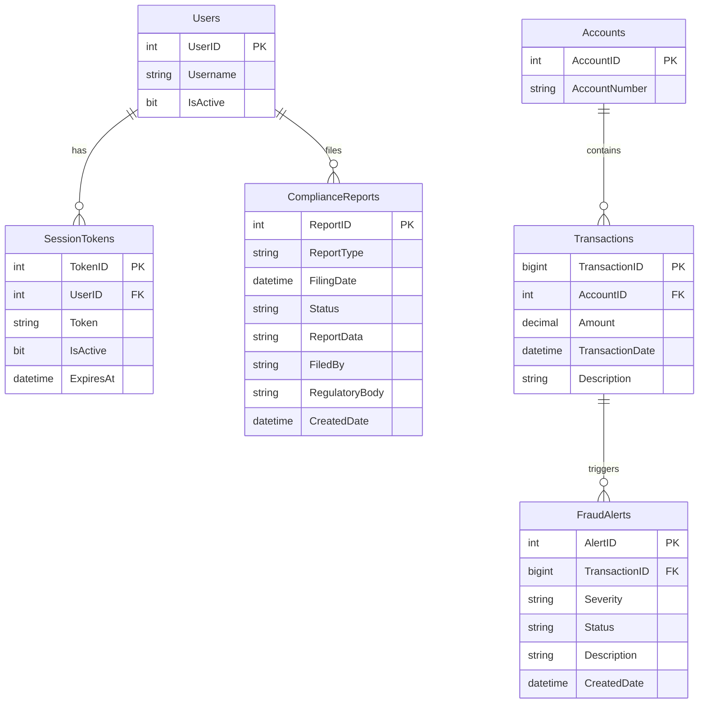

# Data Architecture & Persistence Layer

ZavaComplianceReporter uses a single Microsoft SQL Server database accessed exclusively through raw JDBC (no ORM, no migration tool); six logical tables span authentication, transaction data, fraud alerting, and compliance report storage.

## Database Configuration

| Service/Module | DB Type | Profile | Driver | Connection | Migration Tool |
|---|---|---|---|---|---|
| ZavaComplianceReporter | Microsoft SQL Server | All (single profile) | mssql-jdbc 12.8.1.jre8 | JDBC URL built from `DB_HOST`/`DB_PORT`/`DB_NAME` env vars (falls back to `compliance.properties`); `encrypt=false; trustServerCertificate=true` | None — schema managed entirely outside the application |

No Flyway, Liquibase, or any other migration tool is present. Schema DDL and initial seed data must be applied manually or via external scripts before the application starts. Connection pooling is **not configured** — a new physical connection is opened via `DriverManager.getConnection()` on every request and closed in a try-with-resources block. See `configuration-inventory.md` for the full property inventory.

## Data Ownership per Service

| Service | Tables Owned | ORM Framework | Caching | Notes |
|---|---|---|---|---|
| ZavaComplianceReporter | Users, SessionTokens, Accounts, Transactions, FraudAlerts, ComplianceReports | None (raw JDBC) | None | All tables are in the single `ZavaBankDB` database; no schema separation between domains |

## Entity Model

> Note: No JPA/Hibernate entities exist. Tables and columns are inferred from SQL queries in `GenerateReportServlet.java`, `ReportsServlet.java`, `DownloadReportServlet.java`, and `SsoSessionService.java`.

## Key Repository Methods

No repository interfaces or DAO classes exist — all data access is inline within each Servlet using raw JDBC `PreparedStatement`. The table below documents the effective query operations per servlet.

| Service | Servlet / Access Point | Notable SQL Operations | Purpose |
|---|---|---|---|
| ZavaComplianceReporter | `SsoSessionService` | `SELECT TOP 1 st.UserID, u.Username FROM SessionTokens st JOIN Users u ON st.UserID = u.UserID WHERE st.Token = ? AND st.IsActive = 1 AND st.ExpiresAt > GETDATE() AND u.IsActive = 1` | Validates a session token and resolves the authenticated user |
| ZavaComplianceReporter | `ReportsServlet` | `SELECT TOP 100 ReportID, ReportType, FilingDate, Status, FiledBy FROM ComplianceReports ORDER BY FilingDate DESC` | Lists the 100 most-recent compliance reports for the reports dashboard |
| ZavaComplianceReporter | `GenerateReportServlet` (CTR) | `SELECT TOP 200 t.TransactionID, a.AccountNumber, t.Amount, t.TransactionDate, t.Description FROM Transactions t JOIN Accounts a ON t.AccountID = a.AccountID WHERE ABS(t.Amount) >= ? ORDER BY t.TransactionDate DESC` | Fetches large-currency transactions above a configurable threshold for CTR generation |
| ZavaComplianceReporter | `GenerateReportServlet` (SAR) | `SELECT TOP 200 AlertID, TransactionID, Severity, Status, Description, CreatedDate FROM FraudAlerts WHERE Severity IN ('High','Critical') OR Status IN ('New','InReview') ORDER BY CreatedDate DESC` | Fetches high/critical and unresolved fraud alerts for SAR generation |
| ZavaComplianceReporter | `GenerateReportServlet` (save) | `INSERT INTO ComplianceReports (ReportType, FilingDate, Status, ReportData, FiledBy, RegulatoryBody, CreatedDate) VALUES (?, GETDATE(), 'Generated', ?, ?, 'FinCEN', GETDATE())` | Persists a newly generated report with filer attribution |
| ZavaComplianceReporter | `DownloadReportServlet` | `SELECT ReportType, ReportData FROM ComplianceReports WHERE ReportID = ?` | Retrieves a specific report's full text content for download |

All queries use `PreparedStatement` parameterization. No stored procedures or batch operations are used. No transaction management annotations are present; each operation uses its own implicit auto-commit JDBC transaction.

## Caching Strategy

No caching layer is present. All data is read directly from SQL Server on every request with no in-memory, distributed, or second-level cache. Repeated report listing calls (`ReportsServlet`) hit the database each time. Session state is stored in the Tomcat `HttpSession` (JVM heap only) — once `SessionUser` is resolved and stored in the session, subsequent requests within the same session do not re-query the database for authentication.

## Data Ownership Boundaries

All tables reside in a single shared SQL Server database (`ZavaBankDB`). There is no schema-per-domain, no logical separation between authentication data (`Users`, `SessionTokens`), financial data (`Accounts`, `Transactions`, `FraudAlerts`), and compliance data (`ComplianceReports`). The application is the sole data owner — no other service is known to access these tables, but there is no enforcement mechanism.

Cross-service data access: `SsoSessionService` reads `Users` and `SessionTokens` for authentication; `GenerateReportServlet` reads `Transactions`/`Accounts`/`FraudAlerts` for report content and writes to `ComplianceReports`. All access is direct JDBC; there is no inter-service API call for data retrieval. The only external call is to the Auth Gateway to translate a `.ZAVAAUTH` SSO cookie into a session token (see `api-service-contracts.md`).

### Data Classification & Sensitivity

| Entity/Table | Sensitive Fields | Classification | Controls in Place |
|---|---|---|---|
| Users | Username | PII | No encryption-at-rest or masking configured |
| SessionTokens | Token | Credentials / Auth Secret | Stored in plain text; no hashing or encryption at rest |
| Accounts | AccountNumber | PCI-adjacent (bank account identifier) | No encryption-at-rest or masking configured |
| Transactions | Amount, TransactionDate, Description | Financial / PCI-adjacent | No encryption-at-rest or masking configured |
| FraudAlerts | Description, Severity, Status | Financial Compliance | No encryption-at-rest or masking configured |
| ComplianceReports | ReportData, FiledBy | Financial Compliance / PII (filer name) | ReportData stored as raw text in the DB; no encryption-at-rest, field masking, or access controls configured |

**Summary**: The database stores financial transaction data (PCI-adjacent), bank account numbers, session tokens in plain text, and full compliance report text. No encryption-at-rest, field-level masking, column encryption, or row-level security is configured at the application level. Transport encryption for the JDBC connection is explicitly **disabled** (`encrypt=false; trustServerCertificate=true` in the connection URL), meaning data in transit between the application and SQL Server is unencrypted.
