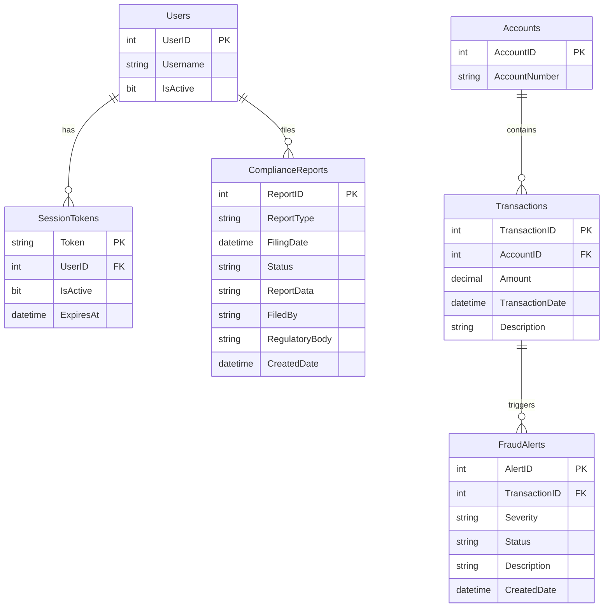

# Data Architecture & Persistence Layer

ZavaComplianceReporter uses a single Microsoft SQL Server database (`ZavaBankDB`) accessed entirely through raw JDBC — there is no ORM, no connection pool, and no schema migration tool. The data layer spans 6 inferred tables across compliance reporting, transaction processing, fraud management, and identity.

## Database Configuration

| Service/Module | DB Type | Profile | Driver | Connection | Migration Tool |
|----------------|---------|---------|--------|------------|----------------|
| ZavaComplianceReporter | Microsoft SQL Server | All (single profile) | `mssql-jdbc 12.8.1.jre8` (JRE 8 variant) | JDBC URL built from `db.host`, `db.port`, `db.name` config; `encrypt=false; trustServerCertificate=true`; no connection pool | None |

Schema management: No DDL auto-generation or migration tool (Flyway/Liquibase) is present. The database schema is presumed to be managed externally or provisioned manually. No seed data scripts are detected in the project. See `configuration-inventory.md` for the full property inventory.

## Data Ownership per Service

| Service | Tables Owned | ORM Framework | Caching | Notes |
|---------|-------------|--------------|---------|-------|
| ZavaComplianceReporter | `ComplianceReports`, `Transactions`, `Accounts`, `FraudAlerts`, `SessionTokens`, `Users` | None (raw JDBC / `DriverManager`) | None | All 6 tables reside in a single shared SQL Server database. There is no schema separation, tenant isolation, or database-per-service boundary. |

## Entity Model

> **Note:** No JPA/ORM entities are present. The table model below is inferred from SQL statements in the Java source code. Field types are inferred from JDBC access patterns (`getString`, `getInt`, `getBigDecimal`, `getTimestamp`).

## Key Repository Methods

There are no formal repository interfaces. All data access is performed inline within Servlet methods via `ComplianceConnectionFactory.openConnection()`. The table below documents the effective query operations:

| Component | Effective Query / Operation | Tables | Purpose |
|-----------|---------------------------|--------|---------|
| `SsoSessionService.resolveSessionUser` | `SELECT TOP 1 st.UserID, u.Username FROM SessionTokens st INNER JOIN Users u ON st.UserID = u.UserID WHERE st.Token=? AND st.IsActive=1 AND st.ExpiresAt > GETDATE() AND u.IsActive=1 ORDER BY st.ExpiresAt DESC` | `SessionTokens`, `Users` | Authenticate a session token and return the owning user |
| `ReportsServlet.loadReports` | `SELECT TOP 100 ReportID, ReportType, FilingDate, Status, FiledBy FROM ComplianceReports ORDER BY FilingDate DESC` | `ComplianceReports` | List the 100 most recent compliance reports |
| `GenerateReportServlet.generateCtrData` | `SELECT TOP 200 t.TransactionID, a.AccountNumber, t.Amount, t.TransactionDate, t.Description FROM Transactions t INNER JOIN Accounts a ON t.AccountID = a.AccountID WHERE ABS(t.Amount) >= ? ORDER BY t.TransactionDate DESC` | `Transactions`, `Accounts` | Retrieve large-value transactions above a threshold for CTR generation |
| `GenerateReportServlet.generateSarData` | `SELECT TOP 200 AlertID, TransactionID, Severity, Status, Description, CreatedDate FROM FraudAlerts WHERE Severity IN ('High','Critical') OR Status IN ('New','InReview') ORDER BY CreatedDate DESC` | `FraudAlerts` | Retrieve high-severity or unresolved fraud alerts for SAR generation |
| `GenerateReportServlet.saveReport` | `INSERT INTO ComplianceReports (ReportType, FilingDate, Status, ReportData, FiledBy, RegulatoryBody, CreatedDate) VALUES (?,GETDATE(),'Generated',?,?,'FinCEN',GETDATE())` | `ComplianceReports` | Persist a newly generated CTR or SAR report |
| `DownloadReportServlet.doGet` | `SELECT ReportType, ReportData FROM ComplianceReports WHERE ReportID = ?` | `ComplianceReports` | Fetch a specific report for file download |

**Transaction management:** No explicit transaction management (`@Transactional` or `Connection.setAutoCommit(false)`) is used. Each `Connection` is opened in auto-commit mode (JDBC default). Partial failures within a single request are not rolled back.

## Caching Strategy

No caching layer is configured. There is no Redis, EhCache, Caffeine, or Spring Cache (`@Cacheable`) in the project. All data is read directly from SQL Server on every request. HTTP session storage (`HttpSession`) is used exclusively for user identity, not for query result caching.

## Data Ownership Boundaries

All tables reside in a single shared SQL Server instance (`ZavaBankDB`). There is no database-per-service separation, no schema-per-service partitioning, and no logical ownership boundary enforced at the data layer. The application is the sole writer and reader of all tables.

Cross-service data access is limited to the outbound HTTP call to the ZavaBank Auth Gateway for cookie-to-token resolution; no database-level cross-service access occurs. Session token validation is performed directly against the `SessionTokens` and `Users` tables in the same database.

Read/write patterns are simple request-scoped reads and writes — there is no CQRS separation, read replica, or eventual consistency concern.

### Data Classification & Sensitivity

| Entity / Table | Sensitive Fields | Classification | Controls in Place |
|----------------|-----------------|---------------|-------------------|
| `ComplianceReports` | `ReportData` (contains account numbers, transaction amounts, personal details), `FiledBy` (officer username) | PII, PCI (financial transaction data reportable to FinCEN) | None detected — no encryption-at-rest, no field-level masking, no access-control beyond servlet authentication |
| `Users` | `Username` | PII | None detected |
| `SessionTokens` | `Token` (authentication credential) | Credentials / Security-sensitive | None detected — tokens stored in plaintext; no hashing |
| `Accounts` | `AccountNumber` | PCI (bank account identifiers) | None detected |
| `Transactions` | `Amount`, `Description`, `AccountID` | PCI (financial transaction records) | None detected |
| `FraudAlerts` | `Description` (may contain account/personal details), `Severity`, `Status` | PII, PCI | None detected |

**Summary:** The application processes and stores PCI-relevant financial data and PII for a FinCEN-regulated compliance workflow. No encryption-at-rest, field-level masking, data-loss prevention, or audit logging is in place. Session tokens are stored and transmitted in plaintext, creating a credential-theft risk. These gaps must be addressed prior to any cloud deployment.
