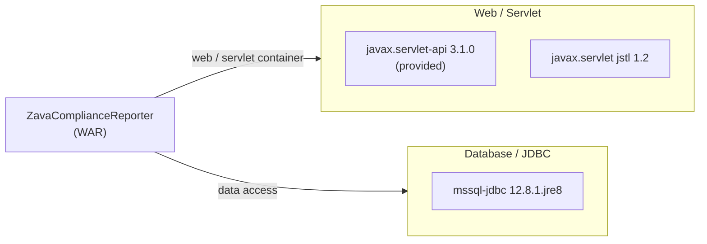

# Dependency Map

ZavaComplianceReporter is a single-module Gradle project with 3 declared runtime/provided dependencies and no test-scoped dependencies detected in the build file.

## Dependencies

### Dependency Summary

| Category | Count | Key Libraries | Notes |
|----------|-------|--------------|-------|
| Web / Servlet | 2 | javax.servlet-api 3.1.0 (provided), javax.servlet jstl 1.2 | Both use the legacy `javax` namespace; incompatible with Jakarta EE 9+ (Tomcat 10+) |
| Database / JDBC | 1 | mssql-jdbc 12.8.1.jre8 | Current Microsoft SQL Server JDBC driver; JRE 8 variant |

### Version & Compatibility Risks

The most significant risk is the **javax namespace**. Both `javax.servlet-api:3.1.0` (provided by Tomcat 9) and `javax.servlet:jstl:1.2` use the `javax.*` package namespace, which was renamed to `jakarta.*` in Jakarta EE 9 (Tomcat 10+). Migrating to a modern container runtime requires replacing both with their Jakarta equivalents (`jakarta.servlet-api` and `org.glassfish.web:jakarta.tags` / `jakarta.servlet.jsp.jstl`). The `mssql-jdbc:12.8.1.jre8` artifact is current as of the build date but targets JRE 8; switching to a JRE 11+ or JRE 17+ variant (`.jre11` / `.jre17`) is required when the runtime is upgraded. The entire project targets Java 8 (`sourceCompatibility = JavaVersion.VERSION_1_8`), which reached end of standard Oracle support in March 2022; upgrading to Java 21 LTS is strongly recommended.

### Notable Observations

- **No HTTP client library declared**: The application makes outbound HTTP calls to the auth gateway using only the built-in `java.net.HttpURLConnection`, with no retry, circuit-breaker, or connection pool logic. Adding a modern HTTP client (e.g., Apache HttpClient 5 or OkHttp) would improve resilience.
- **No connection pooling library**: Direct `DriverManager.getConnection()` is used for every database operation. A connection pool (e.g., HikariCP) is absent and should be introduced before cloud deployment to avoid connection exhaustion under load.
- **No logging framework declared**: There is no SLF4J, Log4j 2, or Logback dependency. The application relies on caught-and-ignored exceptions (`catch (Exception ignored)`), making it impossible to observe failures in production.
- **Minimal dependency footprint**: Only 3 declared dependencies make the migration surface small, but the absence of modern abstractions (frameworks, pooling, logging) means significant manual work is needed to achieve cloud readiness.

## Test Dependencies

No test-scoped dependencies detected.

Total test-scope dependencies: 0

No test framework (JUnit, Mockito, AssertJ, etc.) is declared in `build.gradle`. The project has no unit or integration test infrastructure, which will make validating any migration changes more difficult and increases the risk of regressions.
