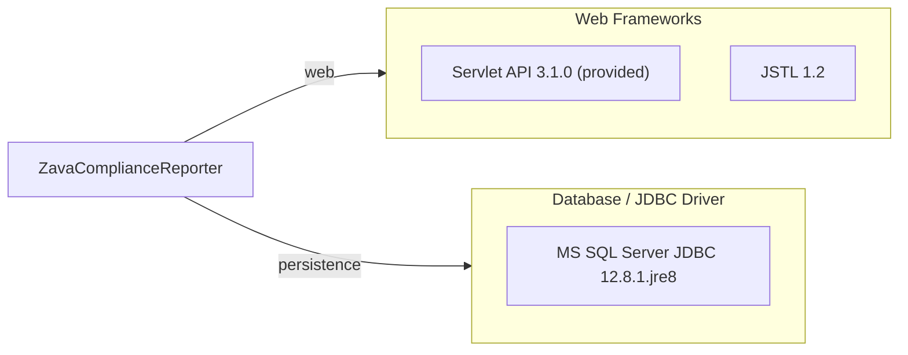

# Dependency Map

ZavaComplianceReporter is a Java 8 Servlet/JSP web application with a minimal dependency footprint — 3 declared external dependencies covering the servlet container contract, JSP tag support, and SQL Server connectivity.

## Dependencies

### Dependency Summary

| Category | Count | Key Libraries | Notes |
|---|---|---|---|
| Web Frameworks | 2 | javax.servlet-api 3.1.0, javax.servlet:jstl 1.2 | Servlet API is `compileOnly` (provided by Tomcat at runtime); JSTL ships in the WAR |
| Database / JDBC Driver | 1 | mssql-jdbc 12.8.1.jre8 | Microsoft JDBC Driver for SQL Server; JRE 8 variant; bundled in the WAR |

### Version & Compatibility Risks

`javax.servlet-api 3.1.0` (released with Java EE 7, 2013) and `javax.servlet:jstl 1.2` are based on the legacy `javax.*` namespace which was superseded by `jakarta.*` in Jakarta EE 9 (2020). Tomcat 10+ and any modern Jakarta EE 10 runtime require the updated `jakarta.servlet-api` and `jakarta.servlet.jsp.jstl` artifacts; the current code is therefore incompatible with Tomcat 10 / Jetty 11+ without a namespace migration. `mssql-jdbc 12.8.1.jre8` is a recent driver release and carries no known end-of-life risk, but the Java 8 (`jre8`) variant will need to be replaced with a Java 11+ variant (`jre11`) before migrating the runtime. No connection-pooling library (HikariCP, DBCP, c3p0) is declared — connections are opened per request via `DriverManager`.

### Notable Observations

- **No dependency injection or framework**: The application uses plain JNDI-free Servlets with no Spring, CDI, or Guice — every dependency is wired manually. This keeps the dependency surface small but means every infrastructure concern (connection management, session handling) is hand-coded.
- **No connection pool declared**: Database connections are obtained from `DriverManager.getConnection()` on every request with no pooling. Under load this will exhaust database connection limits quickly and is a key modernization risk.
- **No logging framework**: No SLF4J, Log4j 2, or Logback is declared; the application silently swallows all exceptions (`catch (Exception ignored)`). This makes production debugging extremely difficult.
- **No security library**: Authentication is fully custom (SSO cookie/token forwarding to an external gateway with manual JSON parsing). No OAuth 2.0 / OIDC client library is used, increasing the attack surface.

## Test Dependencies

No test-scoped dependencies detected.

Total test-scope dependencies: 0

No testing framework (JUnit, Mockito, etc.) is declared in `build.gradle`. The project has no automated test suite, which is a significant quality and modernization risk — functional correctness can only be verified manually.
